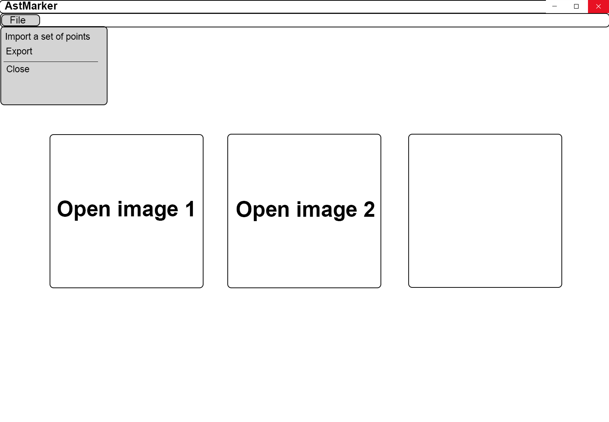
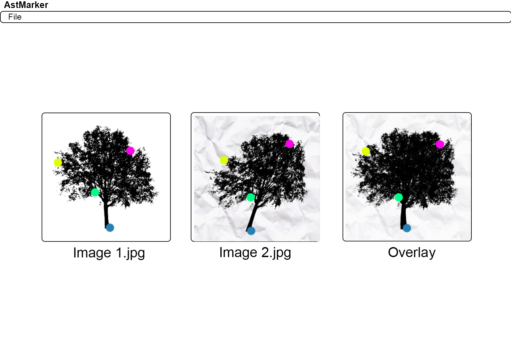
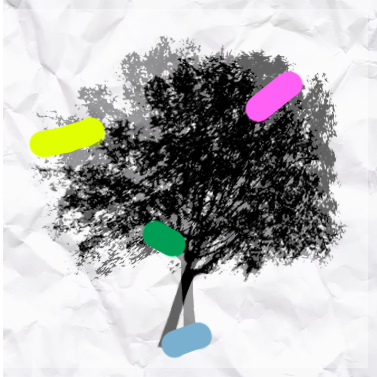

# astmarker
Программа с графическим интерфейсом для полуавтоматической разметки пар точек на изображениях.

Над проектом работают:

- **Козин Вячеслав.** [Репозиторий](https://github.com/vchkz/misis2023f-22-01-kozin-v-v). Обработка точек. Тимлид.
- **Нургалиев Родион.** [Репозиторий](https://github.com/LLrodyaLL/misis2023f-22-01-nurgaliev-r-d). GUI.
- **Лысенко Максим.** [Репозиторий](https://github.com/Solbreen/misis2023f-22-01-lysenko-m-r). GUI.
- **Лопаткин Антон.** [Репозиторий](https://github.com/lopatkinanton/misis2023f-22-01-lopatkin-a-a). Математика пересчёта точек.
- **Булычев Борис.** [Репозиторий](https://github.com/borisbulychev/misis2023f-22-01-bulychev-b-y). 3D-часть.

## Функционал
 - Можно открыть 2 изображения и, опционально, файл с координатами пар точек.

  

  
- Можно размечать точки, нажимая на изображение.

Как только будет размечено 3 пары точек, изображения наложатся друг на друга и будет доступена функция “помоши в разметке”:
Если пользователь отметит точку на одном из изображений, программа, основываясь на интерполяции по ближайшим точкам, “предскажет” где будет находится точка на другом изображении. Пользователь может подтвердить месторасположение точки, либо подвинуть её в нужное место.

По мере разметки пар точек, второе изображение будет искажаться (во втором изображении каждый пиксель в каждом треугольнике будет умножаться на матрицу линейной трансформации для каждого треугольника). Искажённое второе изображение, наложенное поверх первого изображения, отображается в окне Overlay.

   

Точки можно экспортировать.

Также есть функция оценки модели искожения (проективной и аффинной). Изображения с помощью RANSAC накладываются друг на друга по размеченным точкам. Пары точек соединины линиями.

   

