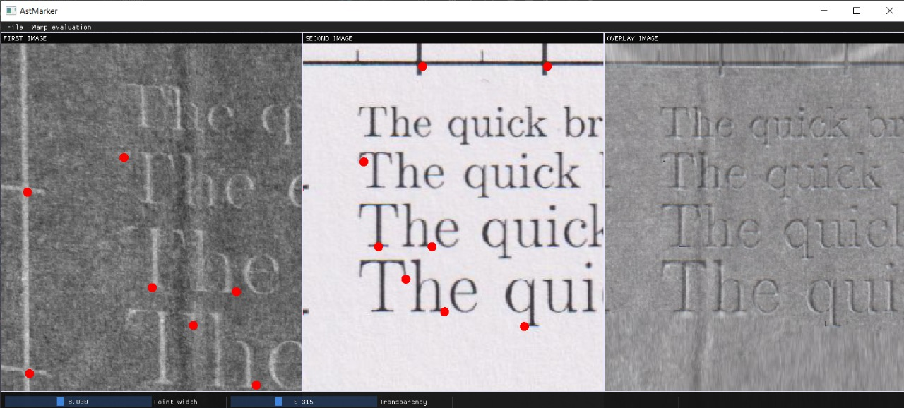
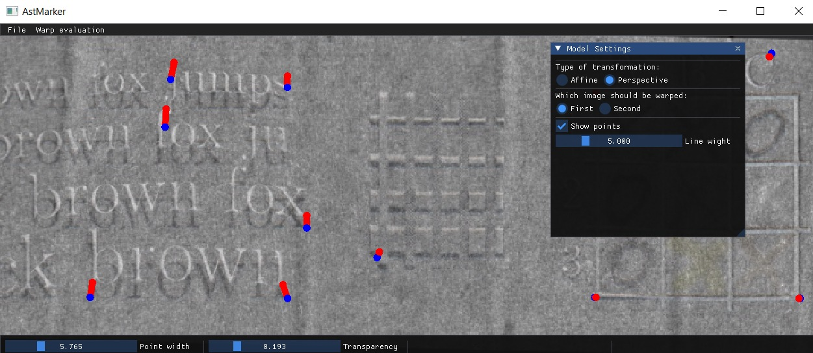

# astmarker

Над проектом работают:

- **Козин Вячеслав.** [Репозиторий](https://github.com/vchkz/misis2023f-22-01-kozin-v-v). Формирование картинки для окна "overlay". Функции для оценки искажений. Тимлид.
- **Нургалиев Родион.** [Репозиторий](https://github.com/LLrodyaLL/misis2023f-22-01-nurgaliev-r-d). GUI: Вывод, перемещение, зум и открытие изображений.
- **Лысенко Максим.** [Репозиторий](https://github.com/Solbreen/misis2023f-22-01-lysenko-m-r). GUI: Создание, перемещение, удаление точек на изображениях.
- **Лопаткин Антон.** [Репозиторий](https://github.com/lopatkinanton/misis2023f-22-01-lopatkin-a-a). Пересчёт координат точек.
- **Булычев Борис.** [Репозиторий](https://github.com/borisbulychev/misis2023f-22-01-bulychev-b-y). 3D-часть.

## Описание
AstMarker - программа с графическим интерфейсом для
полуавтоматической разметки соответствующих пар точек на двух изображениях,
которые являются разными развертками одной поверхности.

## Функционал
 - Открытие и отображение 2 изображений.
 - Открытие (опционально) и отображение точек.
- Разметка точек. "Помощь" пользователью в разметке, используя интерполяцию.
- Построение искажённого изображения (3 Окно).
- Функция оценки моделей искажения (аффинной и проективной).

 
  <em>Окно AstMarker</em>
  

### Разметка точек
- В AstMarker можно открыть два изображения. Их можно одновременно двигать и масштабировать. 
- Можно отметить точку, кликнув по одой из картинок. Основываясь на интерполяции по вершинам треугольника, в котором находится точка, программа
"предскажет", где будет находится соответствующая парная точка.
- Двигая курсор, можно уточнить местоположение предсказанной точки.
- Как только будет отмечена первая пара точек, в третьем окне появится искажённое первое изображение, и наложенное на него неискажённое второе.
- С помощью окна "OVERLAY" можно увидеть где стоит ещё отметить точек.
- Прозрачность наложения и размер точек можно менять в меню снизу.
- 
### Функция оценки моделей искажения

- Можно воспользоваться функцией оценки аффинной и проективной моделей искажения.
- Изображения с помощью RANSAC накладываются друг на друга по размеченным точкам. Пары точек соединины линиями.
- Есть выбор того, какое изображение необходимо трансформировать.
- Размер точек, размер линий и прозрачность можно менять с помощью слайдеров.

 
  <em>Функция оценки моделей искажения</em>
  

